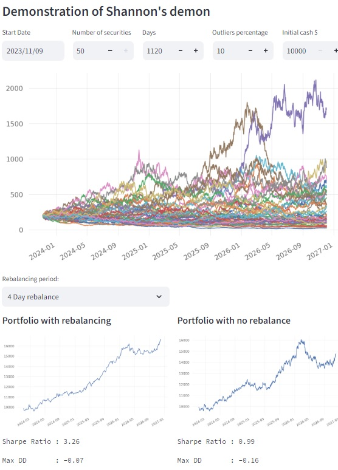

# About

    Shannon's demon aka portfolio rebalancing bonus
    It is maybe the only holy grail in the financial field

    Note: rebalancing cost should be calculated in real life, but for simplicity it is omitted

# Todos

    DONE Simulate one security
    DONE Simulate multiple securities
    DONE Calculate portfolio without rebalance
    DONE Calculate portfolio with periodic rebalancing
    DONE Extract metrics from portfolios
    DONE Make sure to use streamlit

# Configure & Run

    virtualenv -p python3.9 env && source env/bin/activate && pip install -r requirements.txt
    streamlit run main.py

# References

    https://portfoliocharts.com/2022/04/12/unexpected-returns-shannons-demon-the-rebalancing-bonus/

    https://thepfengineer.com/2016/04/25/rebalancing-with-shannons-demon/

    https://matt-rickard.com/shannons-demon

    https://www.youtube.com/watch?v=sR2JxfiH7gk
    

# Screenshot

